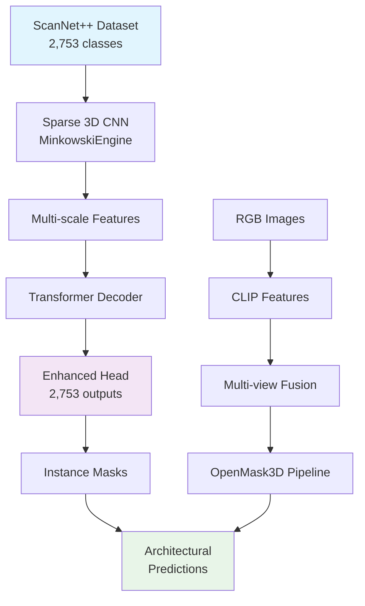

# 🏗️ Architect3D: Enhanced 3D Instance Segmentation for Architectural Scenes

<div align="center">


**Advanced 3D instance segmentation specifically designed for architectural scene understanding**

[📊 Baselines](baseline.md) • [📋 Summary](PROJECT.md) • [🎨 Visualization](interactive_tsne_visualization.html) • [📑 Report](docs/Architect3D.pdf)

</div>

---

## 🎯 Overview

**Architect3D** adapts the state-of-the-art [Mask3D](https://github.com/JonasSchult/Mask3D) model to work with the **ScanNet++** dataset, enabling fine-grained 3D instance segmentation for architectural scenes with **2,753 classes** - a 10x increase from standard datasets.

### ✨ Key Features

- 🏛️ **Architectural Focus**: Specialized for building and indoor architectural scenes
- 📈 **Massive Scale**: Handles 2,753 fine-grained architectural classes
- 🔍 **High Resolution**: Optimized for 0.02m voxel precision
- 🔗 **OpenMask3D Ready**: Prepared for open-vocabulary integration
- 📊 **Comprehensive Evaluation**: Detailed architectural scene analysis

### 🚨 Project Status

> **Note**: Due to computational constraints (GPU limitations, 200GB storage limit), full evaluation is pending. The model has been successfully adapted and the framework is complete.

---

## 📊 Performance Overview

| Model | Dataset | Classes | AP | AP50 | AP25 | Status |
|-------|---------|---------|-----|------|------|--------|
| Mask3D | ScanNet200 | 200 | 26.9 | 36.2 | 41.4 | ✅ Baseline |
| OpenMask3D | ScanNet200 | 200 | 15.4 | 19.9 | 23.1 | ✅ Baseline |
| **Architect3D** | **ScanNet++** | **2,753** | *Pending* | *Pending* | *Pending* | 🔄 Ready |

*See [baseline.md](baseline.md) for detailed comparisons*

---

## 🚀 Quick Start

### Prerequisites

```bash
# System requirements
CUDA >= 11.3
Python >= 3.8
GPU Memory >= 8GB
```

### Installation

```bash
# Clone repository
git clone [your-repo-url]
cd Architect3D

# Install dependencies
pip install -r requirements.txt

# For detailed MinkowskiEngine setup, see below ⬇️
```

### Basic Usage

```bash
# 1. Preprocess ScanNet++ data
cd Architect3D/Mask3D/
sbatch preprocessing.sh

# 2. Run evaluation
sbatch scannetpp_eval.sh

# 3. Generate visualizations
python vis.py
```

---

## 📁 Repository Structure

<details>
<summary><strong>📂 Click to expand detailed structure</strong></summary>

```
Architect3D/
├── 📄 README.md                               # This file
├── 📋 PROJECT_SUMMARY.md                      # Executive summary
├── 📊 baseline.md                             # Performance baselines
├── 🎨 vis.py                                  # t-SNE visualization generator
├── 🌐 interactive_tsne_visualization.html     # Interactive class embeddings
├── 📑 Architect3D.pdf                         # Comprehensive project report
│
├── 🏗️ Architect3D/                            # Core implementation
│   ├── Mask3D/                               # Adapted Mask3D for ScanNet++
│   │   ├── 🚀 main_instance_segmentation.py  # Main training/evaluation script
│   │   ├── ⚙️ conf/                          # Hydra configurations
│   │   ├── 📊 benchmark/                     # Evaluation framework
│   │   ├── 🗃️ datasets/                      # Data loaders & preprocessing
│   │   ├── 🧠 models/                        # Neural network architectures
│   │   ├── 🎯 trainer/                       # Training pipeline
│   │   ├── 💾 saved/final/                   # Model checkpoints
│   │   └── 📈 jobs/                          # Training logs
│   └── 📋 requirements.txt
│
├── 🔍 openmask3d/                             # OpenMask3D integration
│   └── openmask3d/                           # Core modules
│       ├── 🎭 class_agnostic_mask_computation/
│       ├── 🔮 mask_features_computation/
│       ├── 📊 evaluation/
│       └── 👁️ visualization/
│
├── 🏠 scannetpp/                              # ScanNet++ dataset
│   ├── metadata/                             # Class definitions
│   ├── scannetpp_ply/                        # 3D scenes
│   └── splits/                               # Train/val/test splits
│
└── 📊 eval_results_architectural_classes/     # Evaluation results
```

</details>

---

## 🔧 Technical Implementation

### Architecture Adaptations



### Key Modifications

| Component | Original | Architect3D | Improvement |
|-----------|----------|-------------|-------------|
| **Classes** | 200 | **2,753** | 🔥 **13.8x scaling** |
| **Voxel Size** | 0.05m | **0.02m** | 🎯 **2.5x precision** |
| **Domain** | General | **Architectural** | 🏛️ **Specialized** |
| **Head Architecture** | Standard | **Scaled** | ⚡ **Optimized** |

---

## 🛠️ Detailed Installation

<details>
<summary><strong>🔧 Complete MinkowskiEngine Setup (ETH Cluster)</strong></summary>

```bash
# STEP 1: Load modules
module load gcc/8.2.0 python_gpu/3.8.5 cuda/11.3.1 cudnn/8.2.1.32

# STEP 2: Create environment
python -m venv architect3d_env
source architect3d_env/bin/activate

# STEP 3: Install PyTorch
pip install torch==1.12.1 torchvision==0.13.1 -f https://download.pytorch.org/whl/cu113/torch_stable.html

# STEP 4: Install dependencies
pip install ninja pytorch-lightning==1.7.2 hydra-core==1.0.5

# STEP 5: Setup MinkowskiEngine
git clone https://github.com/NVIDIA/MinkowskiEngine.git
cd MinkowskiEngine
# Edit setup.py (uncomment CUDA_HOME configuration)
python setup.py install

# STEP 6: Install additional packages
pip install -r requirements.txt

# STEP 7: Install CLIP & SAM
pip install git+https://github.com/openai/CLIP.git --no-deps
pip install git+https://github.com/facebookresearch/segment-anything.git --no-deps
```

</details>

---

## 📈 Evaluation & Results

### Visualization

🎨 **Interactive t-SNE**: Explore 2,753 architectural class embeddings
- Open `interactive_tsne_visualization.html` in browser
- Visualize class relationships and clusters
- Understand architectural taxonomy

### Metrics

📊 **Comprehensive Evaluation**:
- **AP Metrics**: Standard instance segmentation evaluation
- **Class Analysis**: Head/Common/Tail performance breakdown
- **Architectural Focus**: Building-specific evaluation protocols

---

## 🤝 Acknowledgments

### Core Technologies
- **[Mask3D](https://github.com/JonasSchult/Mask3D)**: Foundation model
- **[ScanNet++](https://kaldir.vc.in.tum.de/scannetpp/)**: Enhanced dataset
- **[OpenMask3D](https://openmask3d.github.io/)**: Open-vocabulary framework
- **[CLIP](https://github.com/openai/CLIP)**: Vision-language features

### Development
This project was developed for the **3D Vision course at ETH Zurich**. Special thanks to supervisors for guidance and the unofficial OpenMask3D codebase.

---

## 📚 Resources

| Resource | Description | Link |
|----------|-------------|------|
| 📑 **Full Report** | Comprehensive documentation | [PDF](Final_Report_Architect3D.pdf) |
| 📊 **Baselines** | Performance comparisons | [Markdown](baseline.md) |
| 📋 **Summary** | Executive overview | [Summary](PROJECT_SUMMARY.md) |
| 🎨 **Visualization** | Interactive t-SNE | [HTML](interactive_tsne_visualization.html) |
| ⚙️ **Configs** | Hydra configuration | [Directory](Architect3D/Mask3D/conf/) |


---

<div align="center">

**🏗️ Built for advancing 3D architectural scene understanding 🏗️**

[](https://ethz.ch)
[](https://www.cvg.ethz.ch)

</div>
